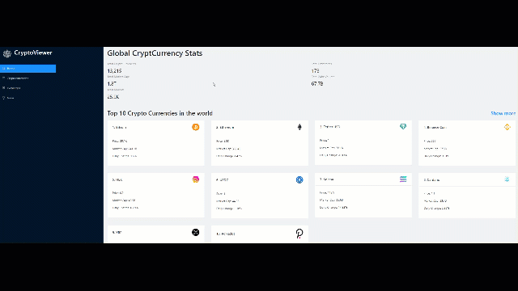

# CryptoViewer

# Overview

CryptoViewer is an application that utilizes React, Redux, Rapid API and Ant Design. The application allows users from to view and serach the latest and most up to date information on the current Cryptocurrencies, exchanges and news. sdfasdfas

the project is currently hosted at https://crypto-viewer-project.netlify.app/

# Architecture and Technologies
* JavaScript, the project's front and backend programing language.
* React, a JavaScript library used to assist with efficient management of rapidly changing data and maintaining a single-page web application structure.
* Redux, a JavaScript library used in coordination with React to create a centralized store for organizing and accessing data.
* Node.js, a runtime environment used to execute JavaScript for server-side scripting.
querying and retrieval of API data.
* Webpack, a JavaScript bundler to assist with development and production builds.
* Ant Design UI, CSS3 and HTML5, used to manage the presentation and styling of the project.
* ChartsJs, a modern JavaScript charting library that helps developers to create beautiful and interactive charts in a React based project.
* RapidAPI, a third-party API hub that allows developers to find and connect to thousands of API's.
* CoinRanking, a third-party Cryptocurrency API that provides high-quality data about all coins, like price history, circulating supplies, exchanges, trading pairs, and much more.
* Bing News Search API, a third-party API that allows users to send a search query to Bing and get back a list of news that are relevant to the search query.
* Netlify, a cloud hosting platform.

# Functionality
* A polished, intuitive, responsive user interface/experience.
* Up to the minute summary of statistics, data, news of top traded Cryptocurrency leaders.
* Interactive Crytocurrency profiles and charts that allow user to see crypto currency prices fluctuations from 3 hours to 5 years and history/information sources for research.  
* Ability to filter and search for news and information on specific cryptocurrencies.
* List of top exchanges based on current trading volume.  
# Known Issues
* There are currently no known issues that have been discovered.

<!-- # Future Updates
* ability to stress test a user portfolio with various hypothetical economic scenarios
* a portfolio ranking of all portfolios created in the app to see which portfolio ranks the best due to a risk/resturn reward profile. -->

 